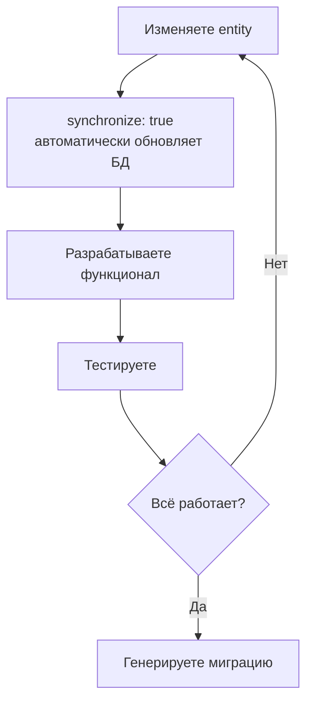

# TypeORM Migrations Guide

## 📚 Содержание

1. [Введение](#введение)
2. [Быстрый старт](#быстрый-старт)
3. [Детальное руководство](#детальное-руководство)
4. [Примеры использования](#примеры-использования)
5. [Best Practices](#best-practices)
6. [Troubleshooting](#troubleshooting)

---

## Введение

### Что такое миграции?

Миграции - это версионный контроль для базы данных. Каждая миграция содержит два метода:
- `up()` - применяет изменения (создание таблиц, добавление колонок и т.д.)
- `down()` - откатывает изменения (rollback)

### Почему миграции важны для Production?

**Development режим** (`synchronize: true`):
```typescript
// ✅ Удобно для разработки
synchronize: true  // Автоматически меняет схему БД под entities
```
- TypeORM автоматически синхронизирует схему БД с entities
- Можно потерять данные при изменении структуры
- Нет контроля над изменениями
- Нет истории изменений

**Production режим** (`миграции`):
```typescript
// ✅ Безопасно для production
synchronize: false       // Не трогает схему БД
migrationsRun: true     // Применяет миграции при старте
```
- Контролируемые изменения схемы БД
- Версионность (история всех изменений)
- Возможность отката (rollback)
- Безопасность данных
- Code review изменений БД

---

## Быстрый старт

### Шаг 1: Убедитесь что база данных запущена

```bash
# Запустите PostgreSQL через Docker Compose
docker-compose up -d db-postgres
```

### Шаг 2: Создайте первую миграцию

```bash
# Сгенерирует миграцию на основе текущих entities
npm run migration:generate -- src/migrations/InitialSchema
```

TypeORM автоматически:
1. Сравнит entities с текущей схемой БД
2. Создаст файл миграции с SQL командами
3. Добавит timestamp в имя файла

### Шаг 3: Проверьте созданную миграцию

```bash
# Откройте файл в src/migrations/
# Например: 1730012345678-InitialSchema.ts
cat src/migrations/*-InitialSchema.ts
```

### Шаг 4: Примените миграцию

```bash
# Применить все новые миграции
npm run migration:run
```

### Шаг 5: Проверьте статус

```bash
# Посмотреть какие миграции применены
npm run migration:show
```

---

## Детальное руководство

### 1. Генерация миграций

#### Автоматическая генерация (рекомендуется)

TypeORM сравнивает entities с БД и генерирует нужный SQL:

```bash
npm run migration:generate -- src/migrations/AddBlackoutIndex
```

**Что происходит:**
1. TypeORM читает все ваши `*.entity.ts` файлы
2. Подключается к БД и читает текущую схему
3. Находит различия
4. Генерирует SQL для синхронизации
5. Создаёт файл миграции

**Примеры имён:**
```bash
# Создание новой функциональности
npm run migration:generate -- src/migrations/AddUserAuthSystem

# Изменение существующей сущности
npm run migration:generate -- src/migrations/UpdateBlackoutAddStatus

# Добавление индексов для производительности
npm run migration:generate -- src/migrations/AddBlackoutDateIndex

# Изменение связей между таблицами
npm run migration:generate -- src/migrations/UpdateCityDistrictRelations
```

#### Ручная генерация (для специальных случаев)

Создаёт пустой шаблон миграции для ручного написания SQL:

```bash
npm run migration:create -- src/migrations/CustomDataMigration
```

**Когда использовать:**
- Миграция данных (не структуры)
- Сложные SQL операции
- Триггеры, функции, процедуры
- Индексы с особыми параметрами

**Пример:**
```typescript
// src/migrations/1730012345678-MigrateOldDataFormat.ts
import { MigrationInterface, QueryRunner } from "typeorm";

export class MigrateOldDataFormat1730012345678 implements MigrationInterface {
    public async up(queryRunner: QueryRunner): Promise<void> {
        // Миграция данных из старого формата в новый
        await queryRunner.query(`
            UPDATE blackouts 
            SET status = 'active' 
            WHERE end_time IS NULL AND status IS NULL
        `);
    }

    public async down(queryRunner: QueryRunner): Promise<void> {
        await queryRunner.query(`
            UPDATE blackouts 
            SET status = NULL 
            WHERE status = 'active'
        `);
    }
}
```

### 2. Применение миграций

#### В Development

```bash
# Вручную применить миграции
npm run migration:run
```

#### В Production

Миграции применяются **автоматически** при запуске приложения:

```typescript
// src/config/typeorm.config.ts
migrationsRun: isProduction  // true в production
```

**Что происходит при старте в production:**
1. Приложение подключается к БД
2. Проверяет таблицу `migrations` (создаётся автоматически)
3. Смотрит какие миграции уже применены
4. Применяет новые миграции по порядку
5. Записывает результат в таблицу
6. Запускает приложение

**Логи в production:**
```
[Nest] 12345  - 10/27/2024, 6:30:00 AM     LOG [InstanceLoader] TypeOrmModule dependencies initialized
[Nest] 12345  - 10/27/2024, 6:30:01 AM     LOG [TypeORM] Migration InitialSchema1730012345678 has been executed successfully
[Nest] 12345  - 10/27/2024, 6:30:01 AM     LOG [TypeORM] Migration AddBlackoutIndex1730012456789 has been executed successfully
```

### 3. Откат миграций

#### Откат последней миграции

```bash
npm run migration:revert
```

**Что происходит:**
1. Находит последнюю применённую миграцию
2. Выполняет метод `down()`
3. Удаляет запись из таблицы `migrations`

#### Откат нескольких миграций

```bash
# Откатить 3 последние миграции
npm run migration:revert
npm run migration:revert
npm run migration:revert
```

⚠️ **ВНИМАНИЕ:** В production откат делать только в крайних случаях!

### 4. Просмотр статуса

```bash
npm run migration:show
```

**Вывод:**
```
[X] InitialSchema1730012345678
[X] AddBlackoutIndex1730012456789
[ ] UpdateCityTable1730012567890
```

- `[X]` - миграция применена
- `[ ]` - миграция не применена

---

## Примеры использования

### Пример 1: Добавление новой колонки

**1. Измените entity:**
```typescript
// src/blackouts/entities/blackout.entity.ts
@Entity('blackouts')
export class Blackout {
  @PrimaryGeneratedColumn()
  id: number;

  @Column()
  address: string;

  // ✨ Новая колонка
  @Column({ nullable: true })
  priority: string;
}
```

**2. Сгенерируйте миграцию:**
```bash
npm run migration:generate -- src/migrations/AddBlackoutPriority
```

**3. Проверьте созданный файл:**
```typescript
// src/migrations/1730012345678-AddBlackoutPriority.ts
export class AddBlackoutPriority1730012345678 implements MigrationInterface {
    name = 'AddBlackoutPriority1730012345678'

    public async up(queryRunner: QueryRunner): Promise<void> {
        await queryRunner.query(`
            ALTER TABLE "blackouts" 
            ADD "priority" character varying
        `);
    }

    public async down(queryRunner: QueryRunner): Promise<void> {
        await queryRunner.query(`
            ALTER TABLE "blackouts" 
            DROP COLUMN "priority"
        `);
    }
}
```

**4. Примените миграцию:**
```bash
npm run migration:run
```

### Пример 2: Добавление индекса

**1. Измените entity:**
```typescript
@Entity('blackouts')
@Index(['city_id', 'start_time'])  // ✨ Новый индекс
export class Blackout {
  @Column()
  city_id: number;

  @Column()
  start_time: Date;
}
```

**2. Сгенерируйте миграцию:**
```bash
npm run migration:generate -- src/migrations/AddBlackoutCityDateIndex
```

**3. Миграция будет содержать:**
```typescript
public async up(queryRunner: QueryRunner): Promise<void> {
    await queryRunner.query(`
        CREATE INDEX "IDX_blackouts_city_start" 
        ON "blackouts" ("city_id", "start_time")
    `);
}
```

### Пример 3: Изменение типа колонки

**1. Измените entity:**
```typescript
@Entity('blackouts')
export class Blackout {
  // Было: @Column({ type: 'varchar' })
  @Column({ type: 'text' })  // ✨ Изменили тип
  description: string;
}
```

**2. Сгенерируйте миграцию:**
```bash
npm run migration:generate -- src/migrations/UpdateBlackoutDescriptionType
```

### Пример 4: Создание связи между таблицами

**1. Добавьте связь в entity:**
```typescript
@Entity('blackouts')
export class Blackout {
  @ManyToOne(() => City, city => city.blackouts)
  @JoinColumn({ name: 'city_id' })
  city: City;
}

@Entity('cities')
export class City {
  @OneToMany(() => Blackout, blackout => blackout.city)
  blackouts: Blackout[];
}
```

**2. Сгенерируйте миграцию:**
```bash
npm run migration:generate -- src/migrations/AddBlackoutCityRelation
```

**3. Миграция создаст foreign key:**
```typescript
public async up(queryRunner: QueryRunner): Promise<void> {
    await queryRunner.query(`
        ALTER TABLE "blackouts" 
        ADD CONSTRAINT "FK_blackouts_city" 
        FOREIGN KEY ("city_id") 
        REFERENCES "cities"("id") 
        ON DELETE CASCADE
    `);
}
```

### Пример 5: Миграция данных

**Задача:** У нас была колонка `full_address`, теперь разделяем на `street` и `building`.

```bash
npm run migration:create -- src/migrations/SplitAddressFields
```

```typescript
export class SplitAddressFields1730012345678 implements MigrationInterface {
    public async up(queryRunner: QueryRunner): Promise<void> {
        // 1. Добавляем новые колонки
        await queryRunner.query(`
            ALTER TABLE "blackouts" 
            ADD "street" varchar,
            ADD "building" varchar
        `);

        // 2. Мигрируем данные
        await queryRunner.query(`
            UPDATE "blackouts" 
            SET 
                "street" = split_part("full_address", ',', 1),
                "building" = split_part("full_address", ',', 2)
            WHERE "full_address" IS NOT NULL
        `);

        // 3. Удаляем старую колонку
        await queryRunner.query(`
            ALTER TABLE "blackouts" 
            DROP COLUMN "full_address"
        `);
    }

    public async down(queryRunner: QueryRunner): Promise<void> {
        // Откат: восстанавливаем full_address
        await queryRunner.query(`
            ALTER TABLE "blackouts" 
            ADD "full_address" varchar
        `);

        await queryRunner.query(`
            UPDATE "blackouts" 
            SET "full_address" = CONCAT("street", ', ', "building")
            WHERE "street" IS NOT NULL
        `);

        await queryRunner.query(`
            ALTER TABLE "blackouts" 
            DROP COLUMN "street",
            DROP COLUMN "building"
        `);
    }
}
```

---

## Best Practices

### ✅ DO (Делайте так)

#### 1. Всегда тестируйте на dev окружении

```bash
# 1. Создайте миграцию
npm run migration:generate -- src/migrations/AddFeature

# 2. Примените на dev
npm run migration:run

# 3. Проверьте что всё работает
npm run start:dev

# 4. Проверьте откат
npm run migration:revert

# 5. Снова примените
npm run migration:run
```

#### 2. Используйте описательные имена

```bash
# ❌ Плохо
npm run migration:generate -- src/migrations/Update
npm run migration:generate -- src/migrations/Fix

# ✅ Хорошо
npm run migration:generate -- src/migrations/AddUserEmailIndex
npm run migration:generate -- src/migrations/UpdateBlackoutAddStatusColumn
npm run migration:generate -- src/migrations/RemoveDeprecatedCityFields
```

#### 3. Один функционал = одна миграция

```bash
# ❌ Плохо - всё в одной миграции
npm run migration:generate -- src/migrations/UpdateEverything

# ✅ Хорошо - разделите по функциям
npm run migration:generate -- src/migrations/AddUserRoles
npm run migration:generate -- src/migrations/AddBlackoutCategories
npm run migration:generate -- src/migrations/AddCityCoordinates
```

#### 4. Всегда проверяйте метод down()

```typescript
// ✅ Хороший пример
export class AddUserEmail1730012345678 implements MigrationInterface {
    public async up(queryRunner: QueryRunner): Promise<void> {
        await queryRunner.query(`ALTER TABLE "users" ADD "email" varchar`);
    }

    public async down(queryRunner: QueryRunner): Promise<void> {
        // Корректный откат
        await queryRunner.query(`ALTER TABLE "users" DROP COLUMN "email"`);
    }
}
```

#### 5. Делайте backup перед миграцией в production

```bash
# Автоматический backup через наш сервис
docker exec db-postgres-prod /backup.sh

# Или вручную
docker exec db-postgres-prod pg_dump -U produser blackouts > backup_before_migration.sql
```

#### 6. Коммитьте миграции вместе с кодом

```bash
git add src/blackouts/entities/blackout.entity.ts
git add src/migrations/1730012345678-AddBlackoutPriority.ts
git commit -m "feat: add priority field to blackout entity"
```

### ❌ DON'T (Не делайте так)

#### 1. НЕ редактируйте применённые миграции

```typescript
// ❌ НИКОГДА не делайте так:
// Изменяете уже применённую миграцию
export class InitialSchema1730012345678 implements MigrationInterface {
    public async up(queryRunner: QueryRunner): Promise<void> {
        // await queryRunner.query(`CREATE TABLE...`);  // Удалили
        await queryRunner.query(`CREATE TABLE... WITH NEW FIELDS`);  // Добавили
    }
}

// ✅ Правильно - создайте новую миграцию
npm run migration:generate -- src/migrations/UpdateInitialSchema
```

#### 2. НЕ удаляйте старые миграции

```bash
# ❌ Не удаляйте файлы миграций
rm src/migrations/1730012345678-InitialSchema.ts

# ✅ Если нужно изменить - создайте новую миграцию
npm run migration:generate -- src/migrations/RevertInitialSchema
```

#### 3. НЕ используйте synchronize в production

```typescript
// ❌ Опасно в production
synchronize: true  // Может удалить данные!

// ✅ Безопасно
synchronize: false
migrationsRun: true
```

#### 4. НЕ забывайте про откат (down метод)

```typescript
// ❌ Плохо - пустой down()
public async down(queryRunner: QueryRunner): Promise<void> {
    // TODO: implement
}

// ✅ Хорошо - корректный откат
public async down(queryRunner: QueryRunner): Promise<void> {
    await queryRunner.query(`DROP TABLE "users"`);
}
```

---

## Workflow для команды

### Development workflow



### Production deployment workflow

```bash
# 1. Закончили разработку фичи
git checkout -b feature/add-blackout-priority

# 2. Изменили entities, всё работает на dev
# (synchronize: true автоматически обновил БД)

# 3. Перед коммитом генерируем миграцию
npm run migration:generate -- src/migrations/AddBlackoutPriority

# 4. Проверяем сгенерированную миграцию
cat src/migrations/*-AddBlackoutPriority.ts

# 5. Тестируем откат
npm run migration:revert  # Откатываем
npm run migration:run     # Применяем снова

# 6. Коммитим вместе
git add src/blackouts/entities/
git add src/migrations/
git commit -m "feat: add priority field to blackouts"

# 7. Push и создаём PR
git push origin feature/add-blackout-priority

# 8. Code review (включая миграцию!)

# 9. Merge в main

# 10. Deploy в production
# Миграция применится автоматически при старте!
```

---

## Troubleshooting

### Проблема 1: "No changes in database schema were found"

```bash
$ npm run migration:generate -- src/migrations/AddFeature
No changes in database schema were found
```

**Причины:**
1. Entity не изменялась
2. Entity не подключена в TypeORM
3. База данных уже синхронизирована

**Решение:**
```typescript
// Проверьте что entity импортирована в module
@Module({
  imports: [
    TypeOrmModule.forFeature([Blackout, City]),  // ✅ Добавлена
  ],
})
```

### Проблема 2: "Migration failed"

```bash
QueryFailedError: relation "users" already exists
```

**Причина:** Пытаетесь применить миграцию, которая уже была применена вручную

**Решение:**
```bash
# Посмотрите статус
npm run migration:show

# Если нужно - пометьте миграцию как выполненную без применения
# (Для этого нужно добавить запись в таблицу migrations вручную)
```

### Проблема 3: Конфликт миграций

```
Error: Migration InitialSchema1730012345678 has already been executed
```

**Причина:** Другой разработчик создал миграцию с таким же названием

**Решение:**
```bash
# 1. Откатите вашу миграцию
npm run migration:revert

# 2. Pull изменения из main
git pull origin main

# 3. Применпримените миграции из main
npm run migration:run

# 4. Создайте новую миграцию с новым именем
npm run migration:generate -- src/migrations/YourFeature

# 5. Timestamp будет другой, конфликта не будет
```

### Проблема 4: Ошибка в миграции на production

```
[TypeORM] Error during migration run: column "old_column" does not exist
```

**Что делать:**

1. **НЕ ПАНИКУЙТЕ** - приложение не запустится, но БД в безопасности
2. **Проверьте логи** - что именно пошло не так
3. **Откатите деплой** - вернитесь к предыдущей версии
4. **Исправьте миграцию** локально
5. **Тестируйте** на копии production БД
6. **Задеплойте исправление**

### Проблема 5: Нужно изменить применённую миграцию

**Ситуация:** Миграция применена в production, но содержит ошибку

**НЕ ПРАВИЛЬНО:**
```bash
# ❌ Редактируете старую миграцию
vim src/migrations/1730012345678-BrokenMigration.ts
```

**ПРАВИЛЬНО:**
```bash
# ✅ Создаёте новую миграцию для исправления
npm run migration:create -- src/migrations/FixBrokenMigration
```

```typescript
export class FixBrokenMigration1730012456789 implements MigrationInterface {
    public async up(queryRunner: QueryRunner): Promise<void> {
        // Исправляем ошибку предыдущей миграции
        await queryRunner.query(`
            ALTER TABLE "blackouts" 
            ALTER COLUMN "priority" TYPE varchar(50)
        `);
    }

    public async down(queryRunner: QueryRunner): Promise<void> {
        // Откат к состоянию после первой миграции
        await queryRunner.query(`
            ALTER TABLE "blackouts" 
            ALTER COLUMN "priority" TYPE varchar
        `);
    }
}
```

---

## Продвинутые техники

### Транзакции в миграциях

```typescript
export class ComplexMigration1730012345678 implements MigrationInterface {
    public async up(queryRunner: QueryRunner): Promise<void> {
        // Всё выполнится в одной транзакции
        await queryRunner.query(`ALTER TABLE "blackouts" ADD "status" varchar`);
        await queryRunner.query(`UPDATE "blackouts" SET "status" = 'active'`);
        await queryRunner.query(`ALTER TABLE "blackouts" ALTER COLUMN "status" SET NOT NULL`);
        
        // Если любая команда упадёт - откатятся ВСЕ изменения
    }
}
```

### Условная логика в миграциях

```typescript
export class ConditionalMigration1730012345678 implements MigrationInterface {
    public async up(queryRunner: QueryRunner): Promise<void> {
        // Проверяем существует ли колонка
        const table = await queryRunner.getTable('blackouts');
        const column = table?.findColumnByName('old_column');
        
        if (column) {
            await queryRunner.query(`ALTER TABLE "blackouts" DROP COLUMN "old_column"`);
        }
    }
}
```

### Миграция больших объёмов данных

```typescript
export class MigrateLargeData1730012345678 implements MigrationInterface {
    public async up(queryRunner: QueryRunner): Promise<void> {
        // Обрабатываем данные порциями
        const batchSize = 1000;
        let offset = 0;
        
        while (true) {
            const result = await queryRunner.query(`
                UPDATE blackouts 
                SET status = 'migrated'
                WHERE id IN (
                    SELECT id FROM blackouts 
                    WHERE status IS NULL 
                    LIMIT ${batchSize}
                )
            `);
            
            if (result[1] === 0) break;  // Нет больше записей
            offset += batchSize;
            
            console.log(`Migrated ${offset} records...`);
        }
    }
}
```

---

## Полезные команды

```bash
# Показать SQL который будет выполнен (dry-run)
npm run migration:show

# Показать детальные логи при выполнении
DEBUG=typeorm:* npm run migration:run

# Применить конкретную миграцию (не работает out of box, нужна настройка)
# npm run migration:run -- --transaction=none --config=./path/to/migration

# Создать миграцию с кастомным путём
npm run migration:create -- src/migrations/custom/MyMigration

# Проверить подключение к БД
npm run migration:show
```

---

## Конфигурация

### typeorm.config.ts (Runtime конфигурация)

```typescript
export async function getTypeOrmConfig(configService: ConfigService): Promise<TypeOrmModuleOptions> {
    const isProduction = configService.get('NODE_ENV') === 'production';
    
    return {
        type: 'postgres',
        host: configService.getOrThrow<string>('POSTGRES_HOST'),
        port: configService.getOrThrow<number>('POSTGRES_PORT'),
        username: configService.getOrThrow<string>('POSTGRES_USER'),
        password: configService.getOrThrow<string>('POSTGRES_PASSWORD'),
        database: configService.getOrThrow<string>('POSTGRES_DB'),
        
        // Entities
        entities: [__dirname + '/**/*.entity{.ts,.js}'],
        autoLoadEntities: true,
        
        // Migrations
        migrations: [__dirname + '/../migrations/*{.ts,.js}'],
        migrationsRun: isProduction,  // ✨ Авто-применение в production
        
        // Sync
        synchronize: !isProduction,  // ✨ Только в development
        
        // Logging
        logging: isProduction 
            ? ['error', 'warn', 'migration']  // Минимальное логирование
            : true,  // Всё логирование
    }
}
```

### typeorm-cli.config.ts (CLI конфигурация)

```typescript
import { DataSource } from 'typeorm';
import { ConfigService } from '@nestjs/config';
import { config } from 'dotenv';

config();  // Загружаем .env

const configService = new ConfigService();

export default new DataSource({
  type: 'postgres',
  host: configService.get('POSTGRES_HOST', 'localhost'),
  port: configService.get('POSTGRES_PORT', 5432),
  username: configService.get('POSTGRES_USER', 'user'),
  password: configService.get('POSTGRES_PASSWORD', 'user123456'),
  database: configService.get('POSTGRES_DB', 'user'),
  entities: ['src/**/*.entity{.ts,.js}'],
  migrations: ['src/migrations/*{.ts,.js}'],
  synchronize: false,  // ❌ Всегда false для CLI
  logging: true,
});
```

---

## Чек-лист перед Production Deploy

- [ ] Миграция сгенерирована и закоммичена
- [ ] Миграция протестирована на dev окружении
- [ ] Проверен метод `down()` (откат работает)
- [ ] Миграция прошла code review
- [ ] Создан backup базы данных
- [ ] Проверено что нет конфликтов с другими миграциями
- [ ] В логах нет ошибок после применения миграции
- [ ] Приложение успешно запускается после миграции
- [ ] Данные корректно мигрированы (если это миграция данных)
- [ ] Есть план отката на случай проблем

---

## Заключение

**Главное правило:** Миграции - это версионный контроль для БД. Относитесь к ним также серьёзно, как к коду.

**Основной workflow:**
1. Development: изменяете entities → `synchronize` обновляет БД
2. Перед коммитом: генерируете миграцию
3. Тестируете миграцию (вперёд и откат)
4. Коммитите вместе с кодом
5. Production: миграции применяются автоматически

**В случае проблем:**
- Не паникуйте
- Проверьте логи
- Используйте откат
- Исправляйте через новую миграцию

**Помните:**
- ✅ Миграции = безопасность
- ✅ Версионность = контроль
- ✅ Откат = уверенность
- ✅ Тестирование = спокойствие
