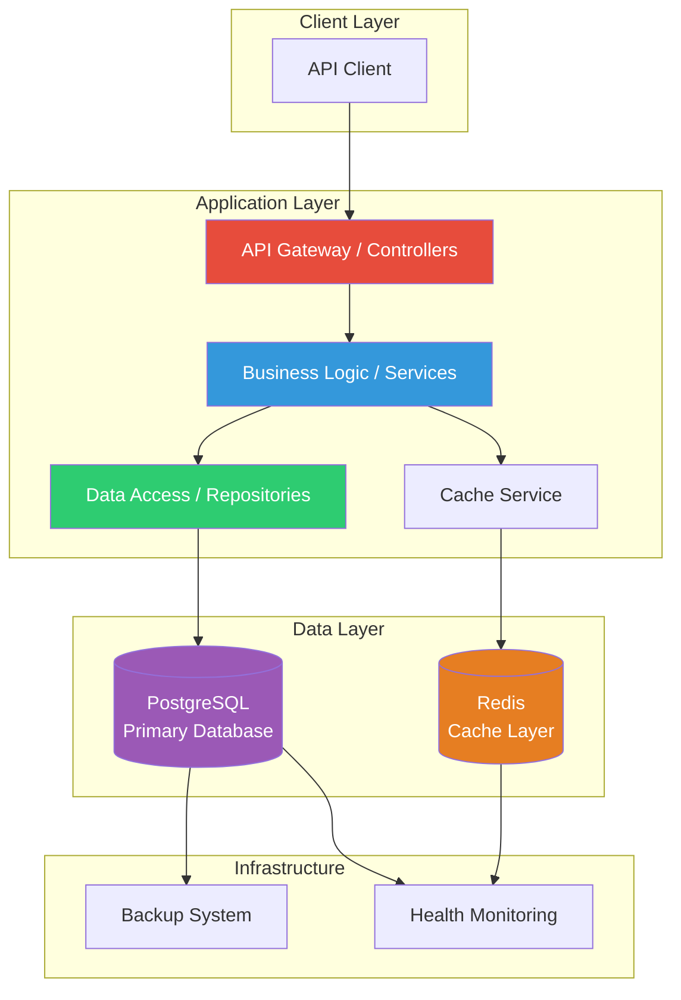
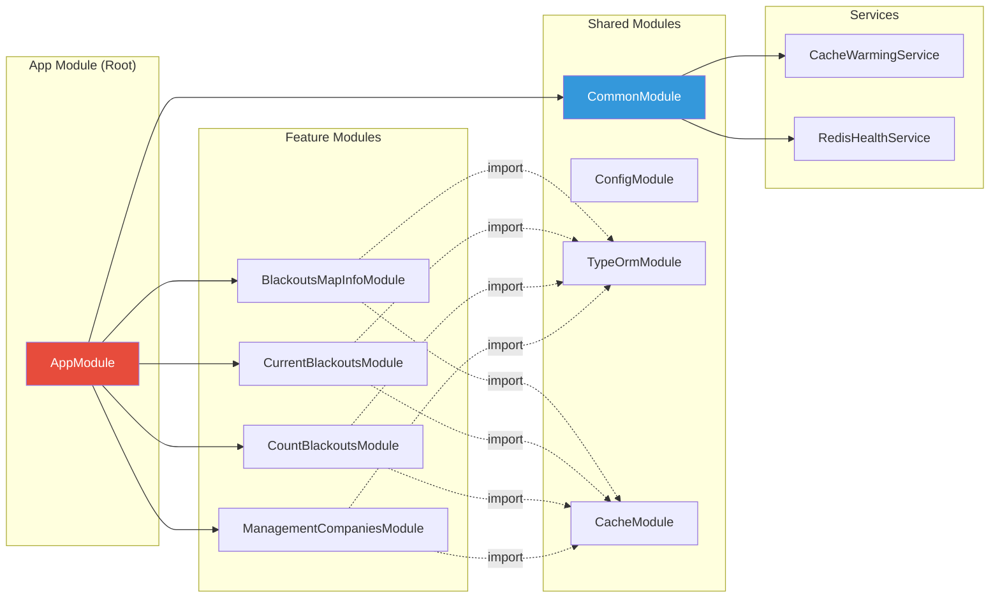
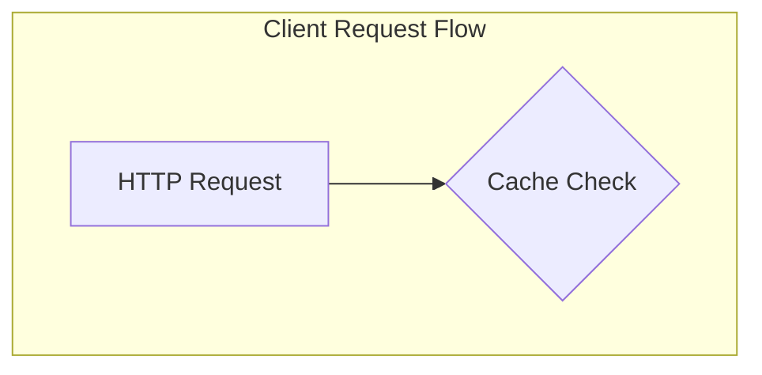
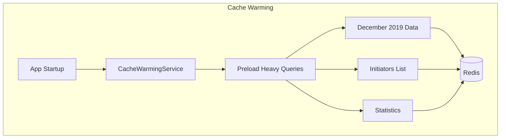
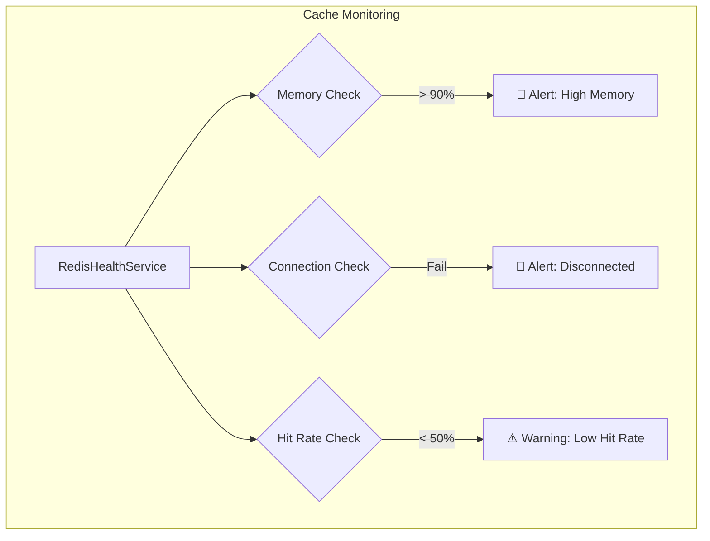
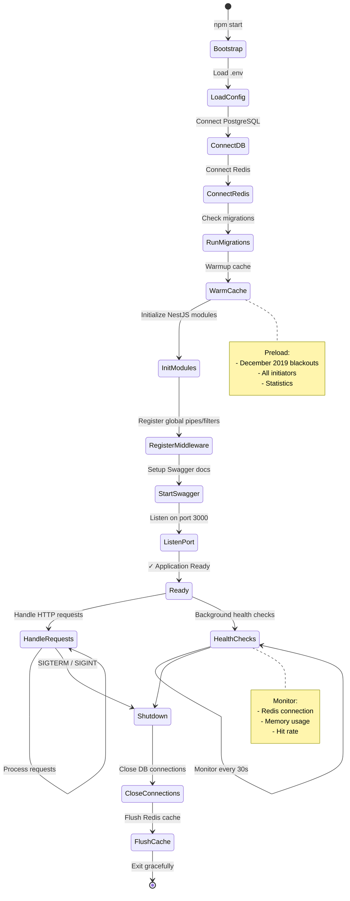
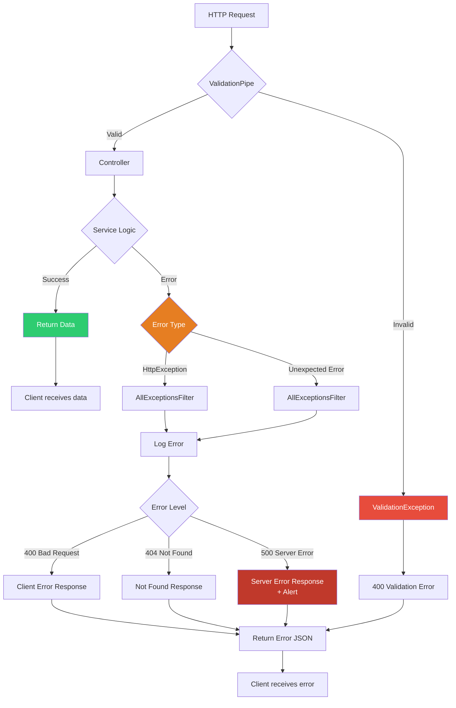

# 📐 Архитектурные диаграммы Backend системы

> Визуализация архитектуры VL.ru Blackouts System с использованием Mermaid диаграмм

---

## 📋 Содержание

1. [Общая архитектура системы](#общая-архитектура-системы)
2. [Структура модулей NestJS](#структура-модулей-nestjs)
3. [Поток обработки запроса](#поток-обработки-запроса)
4. [Система кеширования](#система-кеширования)
5. [Жизненный цикл приложения](#жизненный-цикл-приложения)

---

## Общая архитектура системы

---

## Структура модулей NestJS

---

## Система кеширования

---

## Жизненный цикл приложения

---

## Error Handling Flow

---

## Как вручную посмотреть эти диаграммы

**Для Mermaid Live Editor:**
1. Откройте https://mermaid.live/

**Для GitHub/GitLab:**
- Диаграммы автоматически рендерятся в Markdown

---

**Версия:** 1.0.0

**Автор:** Dropz