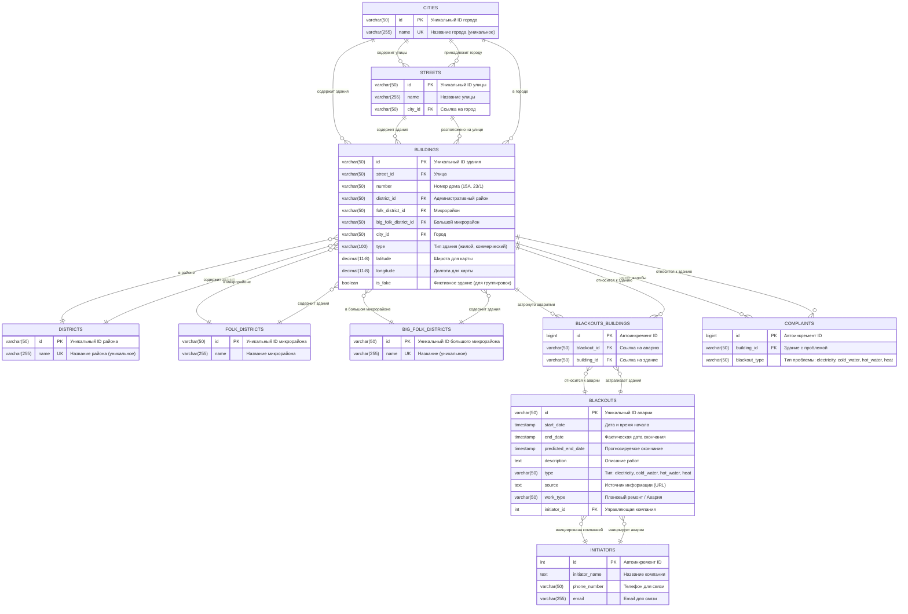

# 🗺️ Полная ERD диаграмма Backend системы VL.ru Blackouts

> Комплексная Entity-Relationship диаграмма с описанием работы всей системы

---

## 📊 Полная ERD диаграмма с описанием всех связей

---

**Документ:** ERD Backend системы (ее базы данных)

**Версия:** 1.0.0  

**Автор:** Dropz
